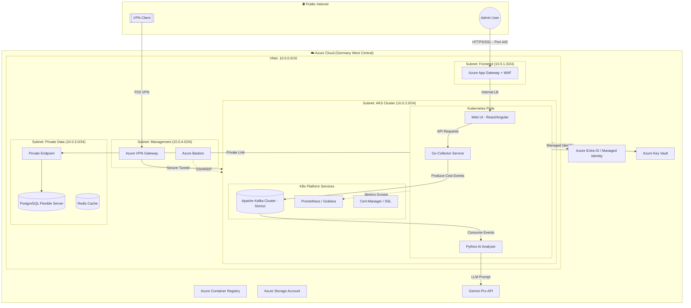

# 🛡️ FinOps Guard: Enterprise Infrastructure

[](https://azure.microsoft.com/)
[](https://www.terraform.io/)
[](https://kubernetes.io/)

## 📖 Overview
**FinOps Guard** is an automated, AI-powered cloud governance platform designed to solve the problem of "Cloud Sprawl" in enterprise environments. This repository contains the **Infrastructure-as-Code (IaC)** required to deploy a secure, scalable, and observable environment on Microsoft Azure.

### 💼 Business Problem
Large organizations often waste 20-30% of their cloud budget on:
- **Zombie Resources:** Unattached disks and idle public IPs.
- **Over-provisioning:** Large VMs running minimal workloads.
- **Lack of Governance:** Resources without cost-center tagging.

### 🚀 Solution
This infrastructure provisions a **Zero Trust** network environment that hosts a Go-based collector and a Python-based AI analyzer (Gemini Pro) to identify and remediate cloud waste automatically.

---

## 🏗️ System Architecture


---
## 🛠️ Tech Stack
*   **Infrastructure:** Terraform, Azure CLI
*   **Cloud Platform:** Microsoft Azure (AKS, VNet, PostgreSQL)
*   **Backend:** Go (Collector), Python (Analyzer + Gemini AI)
*   **Frontend:** React / Angular
*   **CI/CD:** GitHub Actions
---
## 📂 Project Structure
```text
infra-repo/
├── terraform/          # Infrastructure-as-Code
│   ├── modules/        # Reusable networking & AKS modules
│   └── environments/   # Dev/Prod configurations
└── docs/               # Architecture diagrams & specs
