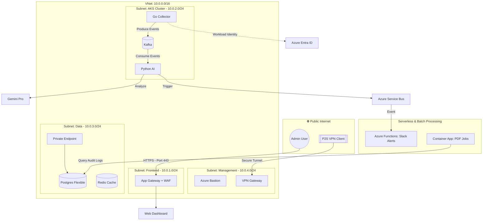

# 🛡️ FinOps Guard: Enterprise Cloud Governance Platform

## 📖 Overview
**FinOps Guard** is an autonomous, enterprise-grade cloud governance platform designed to bridge the gap between infrastructure operations and financial accountability. Leveraging a distributed, event-driven architecture, the platform automates the entire lifecycle of cloud cost management: **Discovery, Analysis, and Remediation.**

Built on a **Zero-Trust networking foundation**, the system utilizes high-performance **Go-based collectors**, **Apache Kafka** for resilient event streaming, and **AI-driven reasoning (Gemini Pro)** to translate complex infrastructure metrics into actionable business intelligence. This project serves as a comprehensive demonstration of senior-level cloud architecture, focusing on scalability, security, and the practical application of AI in modern DevOps workflows.

---

## 💼 The Business Problem: "Cloud Sprawl"
Enterprise organizations in high-velocity sectors (such as Automotive, Finance, and Logistics) frequently experience **20% to 30% wasted cloud spend**. As infrastructure scales, visibility decreases, leading to several critical issues:

*   **Zombie Resources:** Orphaned managed disks, unattached public IPs, and abandoned snapshots that continue to incur costs long after their associated workloads are deleted.
*   **Over-provisioning:** Resource allocation based on "worst-case" scenarios rather than actual demand, resulting in expensive, high-tier instances running at minimal utilization.
*   **Governance Gaps:** Lack of automated tagging and budget attribution, making it impossible for Finance teams to map cloud costs back to specific departments or projects.
*   **Manual Latency:** Traditional "Excel-based" cost reviews are reactive and occur weeks after the waste has already happened.

## 🚀 The Solution
**FinOps Guard** provides a proactive, automated **Financial Security Layer** for the Azure Cloud. It transitions cost management from a manual monthly task to a real-time automated workflow:

1.  **Automated Discovery:** High-performance collectors built in **Go** continuously scan Azure subscriptions to identify underutilized and orphaned resources.
2.  **AI-Driven Analysis:** Utilizing **Gemini Pro (LLM)**, the system translates raw infrastructure metrics into human-readable business intelligence, explaining *why* a resource is wasteful and providing specific remediation advice.
3.  **Event-Driven Remediation:** Leveraging **Apache Kafka** as a durable backbone, the system facilitates asynchronous workflows to alert stakeholders via Slack/Teams or automatically shut down "zombie" resources.
4.  **Zero-Trust Governance:** Built with an enterprise-first mindset, all data processing occurs within a secured, private network environment, ensuring financial data remains protected.
---

## 🏗️ System Architecture

FinOps Guard is built on a **Modular Hybrid-Cloud Architecture**. The design prioritizes network isolation, asynchronous event processing, and managed identity to ensure enterprise-grade security and performance.

---

## 🏛️ Architectural Deep Dive

The **FinOps Guard** architecture is designed around four core pillars: **Security (Zero-Trust)**, **Asynchronicity**, **Resilience**, and **Identity-based Governance**.

### 1. Zero-Trust Network & Perimeter Security
The infrastructure is built on a private-first topology to ensure that financial data and cloud metrics never traverse the public internet unnecessarily.
*   **Subnet Segmentation:** The Virtual Network (VNet) is partitioned into four functional tiers. Traffic between tiers is governed by **Network Security Groups (NSGs)** following the principle of least privilege.
*   **L7 Edge Protection:** External access is handled by an **Azure Application Gateway** with a **Web Application Firewall (WAF)**. This provides SSL termination and protects the frontend against common vulnerabilities (OWASP Top 10).
*   **Secure Management:** Direct access to the internal cluster and database is disabled. Administrators must connect via a **Point-to-Site (P2S) VPN Gateway** or **Azure Bastion**, creating a secure "Admin-in-the-Middle" workflow.

### 2. Event-Driven Microservices Design
To handle the scale of large Azure enterprises, the application logic is decoupled using a high-durability event bus.
*   **The Collector (Go):** Optimized for high-concurrency API interactions. It scans Azure subscriptions and publishes raw resource metrics to **Apache Kafka**. This ensures that discovery is not blocked by slow downstream processing.
*   **The Message Backbone (Kafka):** By deploying **Kafka via the Strimzi Operator**, the system gains the ability to "buffer" spikes in data. It acts as the source of truth for all identified cost events, providing fault tolerance if individual services go offline.
*   **The Analyzer (Python/AI):** A specialized consumer service that processes messages from Kafka. It integrates with **Gemini Pro (LLM)** to provide contextual reasoning, allowing the system to distinguish between "necessary high performance" and "wasteful over-provisioning."

### 3. Data Persistence & Private Connectivity
*   **Azure Private Link:** The **PostgreSQL Flexible Server** is integrated into the VNet via a **Private Endpoint**. This ensures that the database has no public IP address and is only reachable by internal microservices.
*   **Private DNS Zones:** Internal service discovery for the database and internal APIs is handled via Azure Private DNS, preventing DNS leakage and ensuring name resolution remains local to the VNet.

### 4. Identity & Secret Governance
*   **Passwordless Authentication:** The project utilizes **Azure Workload Identity (OIDC)**. AKS pods "inherit" Azure roles without the need for static Client Secrets or connection strings stored in the code.
*   **Key Vault Integration:** All external API keys (e.g., Gemini Pro) and SSL certificates are managed centrally in **Azure Key Vault** and injected into the cluster securely using the Secrets Store CSI Driver.

### 5. Hybrid Compute Strategy

While the core logic resides on **AKS** for maximum control and scalability, the architecture utilizes **Serverless (Azure Functions)** for lightweight, irregular tasks like Slack notifications. This "Right Tool for the Job" approach optimizes operational costs by only running compute for alerts when an actual anomaly is detected.

---

## 🛠️ Tech Stack & Responsibility Matrix

The FinOps Guard platform is built using a "Best-of-Breed" selection of enterprise technologies. Each component is chosen to ensure the system is secure, scalable, and maintainable.

### 🏗️ Infrastructure & Orchestration
| Technology | Role & Responsibility |
| :--- | :--- |
| **Terraform** | **Infrastructure as Code (IaC):** Manages the entire Azure lifecycle using a modular approach to ensure environment parity and reproducible deployments. |
| **Azure Kubernetes Service (AKS)** | **Container Orchestration:** A private cluster hosting the core microservices and the Kafka streaming platform with high availability. |
| **Azure Container Registry (ACR)** | **Artifact Management:** Secure, private storage for Docker images with automated vulnerability scanning. |

### 🌐 Networking & Connectivity
| Technology | Role & Responsibility |
| :--- | :--- |
| **Azure VNet** | **Network Isolation:** Partitioned into four tiers (Frontend, Compute, Data, Management) to enforce strict traffic micro-segmentation. |
| **Application Gateway (WAF)** | **Edge Security:** Provides Layer 7 load balancing, SSL/TLS termination, and Web Application Firewall protection (OWASP rules). |
| **VPN Gateway (P2S)** | **Secure Admin Access:** Establishes an encrypted Point-to-Site tunnel, ensuring the private cluster and database are never exposed to the public internet. |
| **Azure Private Link** | **Data Privacy:** Connects PostgreSQL to the VNet via Private Endpoints, keeping database traffic within the Azure backbone. |

### 📩 Messaging & Logic
| Technology | Role & Responsibility |
| :--- | :--- |
| **Apache Kafka (Strimzi)** | **Event Streaming:** Decouples discovery from analysis. It ensures high-durability and data retention for thousands of concurrent cost-events. |
| **Azure Service Bus** | **Async Messaging:** Triggers serverless workflows (Alerts) based on specific cost anomalies detected by the AI analyzer. |
| **Azure Functions** | **Serverless Alerting:** A lightweight, event-driven service that sends real-time notifications to Slack/Teams when budget thresholds are exceeded. |
| **Azure Container Apps** | **On-Demand Jobs:** Handles scheduled, heavy-compute tasks like generating monthly PDF financial reports and audit summaries. |

### 💾 Data, AI & Identity
| Technology | Role & Responsibility |
| :--- | :--- |
| **Go (Golang)** | **Collector Service:** Leverages high-concurrency and low-latency to scan multiple Azure subscriptions and resource providers. |
| **Python** | **Analyzer Service:** Orchestrates data processing and manages the integration with Large Language Models (LLMs). |
| **Gemini Pro API** | **AI Reasoning:** Translates complex JSON infrastructure metrics into actionable, human-readable cost-remediation strategies. |
| **PostgreSQL (Flexible)** | **Persistence:** Acts as the central source of truth for historical cost data, audit logs, and remediation status. |
| **Azure Entra ID (OIDC)** | **Workload Identity:** Implements passwordless authentication, allowing AKS pods to securely access Azure APIs without static secrets. |
| **Azure Key Vault** | **Secret Management:** Centralized vault for managing SSL certificates, API keys, and database connection strings. |

---

## 🚀 Implementation Roadmap & Checklist

This checklist tracks the progress of the FinOps Guard platform from initial networking to AI-driven automation. It is organized by technical dependencies to ensure a stable deployment.

### 🏗️ Phase 1: Zero-Trust Foundation (Networking)
*Goal: Establish the secure "pipes" and private connectivity.*
- [ ] **Infrastructure Setup:** Initialize Terraform with AzureRM provider and backend state.
- [ ] **Resource Group:** Provision `rg-finops-dev-ge-001` in Germany West Central.
- [ ] **VNet Design:** Provision `vnet-finops-dev` (10.0.0.0/16) with 4 isolated subnets (/24).
- [ ] **Network Security:** Implement **NSG (Network Security Groups)** with a "Deny-All" default rule.
- [ ] **Secure Access:** Deploy **Azure VPN Gateway (P2S)** and **Azure Bastion** for private management.
- [ ] **DNS Governance:** Configure **Azure Private DNS Zones** for internal name resolution.

### 🔐 Phase 2: Security & Identity Layer
*Goal: Implement passwordless authentication and centralized secret management.*
- [ ] **Key Vault:** Provision Azure Key Vault with RBAC-based access policies.
- [ ] **Managed Identities:** Create User-Assigned Identities for the Collector and Analyzer services.
- [ ] **Workload Identity:** Configure OIDC Issuer and Federated Credentials for AKS integration.
- [ ] **RBAC:** Assign "Reader" permissions to the subscription for cost discovery.

### ☸️ Phase 3: The Platform (Compute & Registry)
*Goal: Build the Kubernetes "Factory" and artifact storage.*
- [ ] **Container Registry:** Provision **Azure Container Registry (ACR)** with anonymous pull disabled.
- [ ] **Private AKS:** Deploy a private **Azure Kubernetes Service** cluster within the dedicated subnet.
- [ ] **Identity Integration:** Install and configure the **Azure Workload Identity** webhook.
- [ ] **Ingress Controller:** Deploy Nginx Ingress or utilize the Application Gateway Ingress Controller (AGIC).

### 📩 Phase 4: Data & Messaging Backbone
*Goal: Provision persistence and asynchronous event streaming.*
- [ ] **PostgreSQL:** Deploy **Azure Database for PostgreSQL Flexible Server** in the Data subnet.
- [ ] **Private Link:** Establish **Private Endpoints** to ensure the DB has no public IP.
- [ ] **Event Streaming:** Install the **Strimzi Operator** and provision a 3-node **Kafka Cluster**.
- [ ] **Message Queue:** Provision **Azure Service Bus** for Serverless/Functions triggers.

### 🧠 Phase 5: AI Logic & Microservices
*Goal: Deploy the "Brains" of the system.*
- [ ] **Go Collector:** Build, containerize, and deploy the service to scan Azure APIs.
- [ ] **Python Analyzer:** Build and deploy the service to consume Kafka events and integrate with **Gemini Pro**.
- [ ] **AI Integration:** Securely inject Gemini API keys into the cluster using Key Vault CSI secrets.

### ⚡ Phase 6: Serverless & Edge Security
*Goal: Implement reactive alerting and protect the public entry point.*
- [ ] **Serverless Alerts:** Deploy **Azure Functions** with Service Bus triggers for Slack notifications.
- [ ] **Edge Security:** Configure **Application Gateway + WAF** with SSL certificates.
- [ ] **Reporting:** Deploy **Azure Container App Jobs** for scheduled PDF financial reports.

### 📊 Phase 7: Observability & CI/CD
*Goal: Monitor system health and automate the lifecycle.*
- [ ] **Monitoring:** Install **Prometheus & Grafana** via Helm to track cost savings and pod health.
- [ ] **Automation:** Setup **GitHub Actions** for Terraform (IaC) and Docker (App) pipelines.

