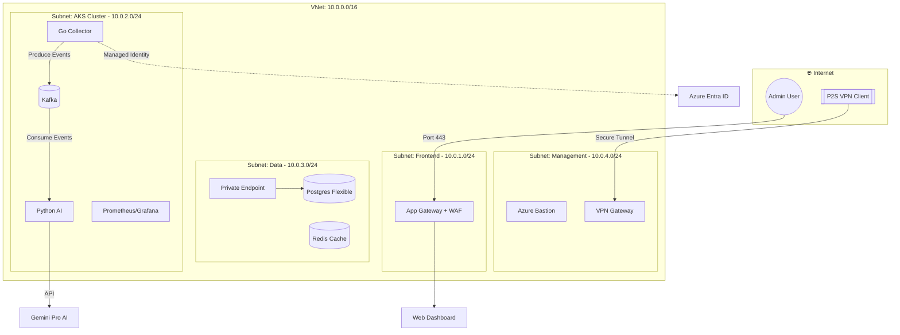

# 🛡️ FinOps Guard: Enterprise Infrastructure

## 📖 Overview
**FinOps Guard** is an autonomous, enterprise-grade cloud governance platform. This repository manages the **Infrastructure-as-Code (IaC)**, providing a highly secure, Zero-Trust environment. It is designed to host an event-driven microservices architecture that identifies, analyzes, and remediates cloud waste across multiple Azure subscriptions.

---

## 💼 Business Problem & Solution
### The Problem
In large-scale enterprise environments (e.g., Automotive, Finance), high-velocity development often leads to **"Cloud Sprawl."** 
- **Zombie Resources:** Orphaned disks, idle public IPs, and abandoned snapshots.
- **Over-provisioning:** Workloads running on oversized VM instances.
- **Hidden Costs:** These factors typically account for **20-30% of wasted cloud spend.**

### The Solution
FinOps Guard provides an automated **"Financial Security Layer"** by:
1. **Discovering:** Real-time scanning of infrastructure via Go-based collectors.
2. **Analyzing:** Utilizing **LLMs (Gemini Pro)** to interpret usage metrics into human-readable cost-saving advice.
3. **Remediating:** Implementing "One-click" or automated deletion of wasteful resources within a secure network boundary.

---

## 🏗️ System Architecture

---
### 🛠️ Tech Stack & Responsibility Matrix
Technology	Role & Responsibility:
- **Terraform	IaC**: Automates the provisioning of the entire Azure environment using a modular, reusable design.
- **Azure VNet	Network Isolation**: Segregates the environment into four distinct subnets to enforce "Least Privilege" traffic flow.
- **AKS (Kubernetes) Compute Platform**: Orchestrates microservices and platform tools (Kafka, Prometheus) with high availability.
- **Apache Kafka Event Streaming**: Decouples the Collector from the Analyzer, ensuring data durability and system resilience.
- **App Gateway + WAF L7 Security**: Manages SSL/TLS termination and protects the frontend from SQLi and XSS attacks.
- **VPN Gateway	Secure Access**: Provides a Point-to-Site (P2S) encrypted tunnel for administrative access to the private network.
- **PostgreSQL	Persistence**: Acts as the "Source of Truth" for cost history, waste reports, and audit logs.
- **Private Link	Data Security**: Ensures that traffic between AKS and PostgreSQL never traverses the public internet.
- **Managed	Identity**: Implements passwordless authentication between Azure services using OIDC.
